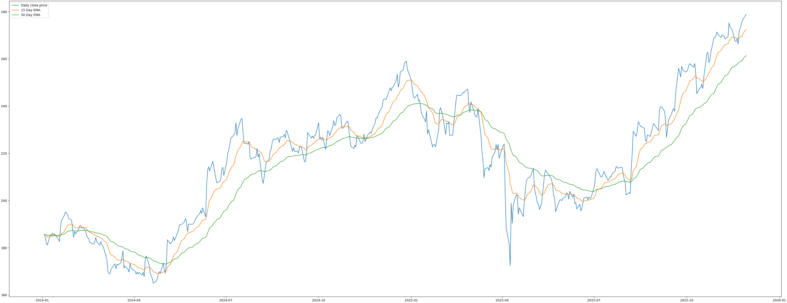
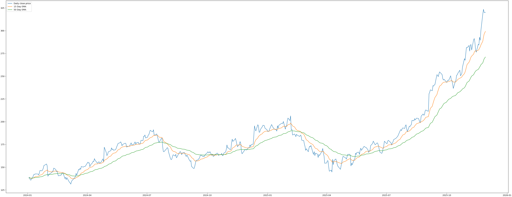

# Trading Helper

- Fetch trading data using Massive API free tier
- Store fetched data locally in SQLite DB
- Analyze using my own algorithm implementations
- Visualize using matplotlib

# Example Visualizations

### Stock price of Apple with Exponential Moving Averages

### Stock price of Google with Exponential Moving Averages

